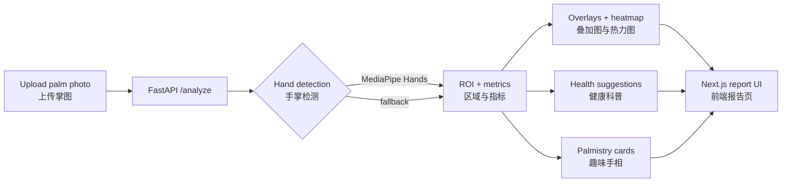
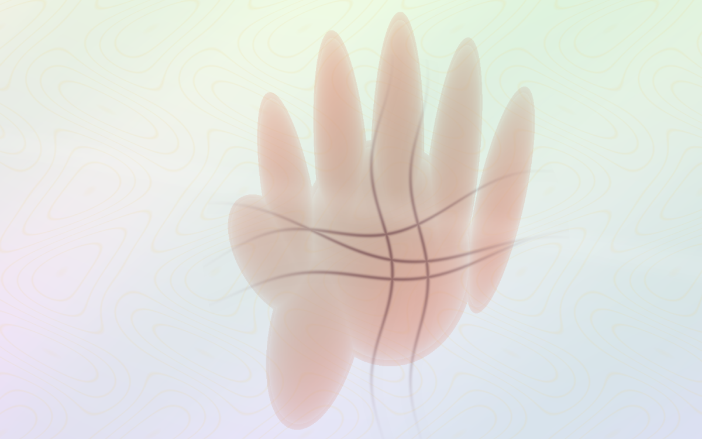
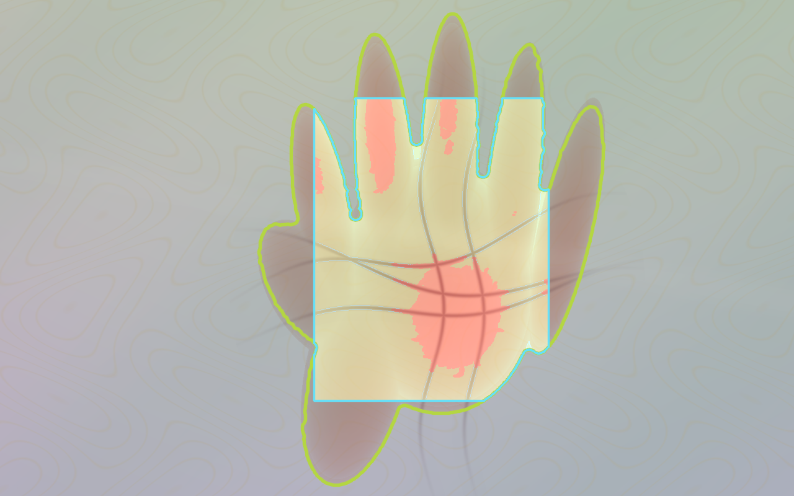
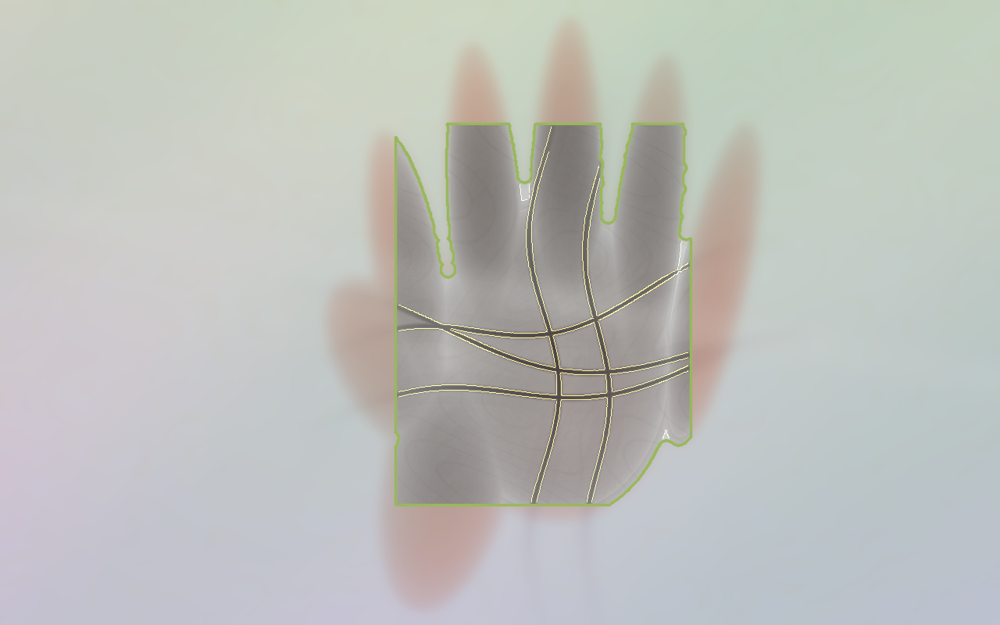
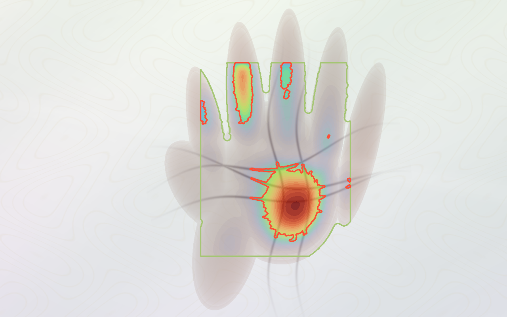

# PalmLens

**[English](#english)** · **[中文](#中文)**

> **PalmLens** — Upload a palm photo, get a visual analysis report with health education and entertainment palm reading.  
> **PalmLens** — 上传手掌照片，获得视觉分析报告：健康科普提示 + 趣味手相解读。

<p align="center">
  <a href="https://palmlens.vercel.app"><strong>Live demo · 在线演示</strong></a>
</p>

---

## Overview · 项目概览

### What is PalmLens? · 这是什么？

**EN:** PalmLens is a full-stack web app that turns a single palm photograph into an interactive, **non-diagnostic** visual report. The frontend (Next.js) handles upload, preview, and bilingual-friendly UI; the backend (FastAPI + OpenCV + MediaPipe) locates the palm, quantifies color and texture, renders three explanation images, and returns structured JSON for health education and optional entertainment palmistry.

**中文：** PalmLens 是一个全栈 Web 应用：用户上传一张手掌照片，系统生成一份**非诊断型**互动视觉报告。前端（Next.js）负责上传、预览与报告展示；后端（FastAPI + OpenCV + MediaPipe）定位掌心、量化颜色与纹理、输出三张解释图，并以 JSON 形式返回健康科普与可选的趣味手相内容。

### Who is it for? · 适合谁？

| Audience · 对象 | Use case · 场景 |
|-----------------|-----------------|
| General users · 普通用户 | Learn how lighting and photo quality affect what you see in a palm image · 了解光线与拍摄质量如何影响掌图观感 |
| Developers · 开发者 | Reference pipeline: hand ROI → metrics → overlays → API contract · 参考「手掌 ROI → 指标 → 叠加图 → API」实现 |
| Educators / demos · 科普演示 | Show computer-vision outputs with clear medical boundaries · 演示计算机视觉结果并强调非诊断边界 |

### What it is NOT · 明确不做的事

**EN:** Not a medical device. No disease names, no diagnosis, no prescriptions. Palmistry is labeled as entertainment only.

**中文：** 不是医疗器械。不输出疾病名称、不做诊断、不给处方。手相模块标注为娱乐用途。

### How it works · 工作原理



1. **Upload · 上传** — JPG / PNG / WebP, max 8 MB, local preview before submit.  
2. **Analyze · 分析** — `POST /analyze` runs palm detection, color stats, redness patches, line clarity.  
3. **Visualize · 可视化** — Overlay (ROI + edges + redness), line-enhanced view, red saturation heatmap.  
4. **Report · 报告** — Scores, health education blocks, recheck tips; switch to palmistry mode for fun line cards.

### Repository layout · 目录结构

```text
PalmLens/
├── frontend/          Next.js 15 app (upload UI + report)
├── backend/           FastAPI analyzer + OpenCV / MediaPipe
├── docs/images/       README screenshots & analyzer exports
├── scripts/           Asset + GitHub image export tools
└── render.yaml        Render backend blueprint
```

---

## Analysis previews · 分析示意图

<p align="center">
  
</p>

<p align="center">
  
</p>

<p align="center">
  <sub>样例图 → 叠加 → 掌纹增强 → 红色热力图 · Sample → overlay → lines → heatmap (non-diagnostic / 非诊断)</sub>
</p>

| | |
|:---:|:---:|
|  |  |
| **叠加图 Overlay** · ROI & markings | **掌纹增强 Palm lines** · contrast-enhanced texture |
|  | |
| **红色热力图 Red heatmap** · high-saturation red pixels | |

---

## UI screenshots · 界面截图

Real product screens (upload → report).  
以下为实际上传与报告界面截图。

### 1. Home — upload area · 首页上传区

<p align="center">
  
</p>

**EN:** Landing state with drag-and-drop upload, format hints, and tags **Visual observation** / **Non-diagnostic**.  
**中文：** 初始页支持点击或拖拽上传，标注支持格式与大小；顶部标签强调「视觉观察」「非诊断」。

### 2. Photo selected — local preview · 已选图本地预览

<p align="center">
  
</p>

**EN:** Original image preview before calling the API; filename and size shown (example: clinical-style palm photo).  
**中文：** 调用分析前展示原图预览与文件信息（示例为掌心发红明显的实拍图）。

### 3. Waiting for analysis · 等待分析

<p align="center">
  
</p>

**EN:** Right panel placeholder with disclaimer: visual observations + health tips + entertainment palmistry only.  
**中文：** 右侧报告区占位，并再次说明：仅视觉观察、科普与娱乐手相，非诊断。

### 4. Composite overlay · 综合叠加图

<p align="center">
  
</p>

**EN:** MediaPipe/outlined palm ROI, line edges, and redness highlight on the detected region.  
**中文：** 显示检测方法（如 MediaPipe Hands）、掌心多边形、掌纹边缘与发红区域叠加。

### 5. Palm-line enhancement · 掌纹增强

<p align="center">
  
</p>

**EN:** Local contrast boost to make creases visible for texture/clarity scoring.  
**中文：** 局部对比度增强，突出掌纹边缘，用于「掌纹评分」与清晰度说明。

### 6. Red heatmap · 红色热力图

<p align="center">
  
</p>

**EN:** Heatmap of high-saturation red pixels—color feature only, not a diagnosis.  
**中文：** 高饱和红色像素分布热力图，仅描述照片中的颜色特征。

### 7. Analysis scores · 分析分数

<p align="center">
  
</p>

**EN:** Six bars—detection confidence, palm area %, brightness, redness index/ratio, palm-line score.  
**中文：** 六项进度条：检测参考、掌心占比、画面亮度、发红指数、发红占比、掌纹评分。

### 8. Health report details · 健康分析详情

<p align="center">
  
</p>

**EN:** Pale/red/texture cards, **Possible directions** (educational), lifestyle notes—always with doctor-consult reminders.  
**中文：** 偏淡/发红/掌纹解读、可能相关健康方向（科普）、生活建议等；强调持续不适应咨询医生。

Toggle **Entertainment palmistry · 趣味手相** in the app for life/head/heart/career line cards (entertainment only).

---

<a id="english"></a>

## English

### Features

- Upload JPG, PNG, or WebP (max 8 MB) with in-browser preview.
- `POST /analyze` returns JSON: images (base64), metrics, observations, tips, `health_suggestions`, `palmistry`.
- Three derived images: overlay, line-enhanced, red heatmap.
- Health mode: attention level, color/redness/texture copy, quality notes, recheck plan, when to see a doctor.
- Palmistry mode: archetype, keywords, four line cards—entertainment disclaimer included.
- Detection: MediaPipe Hands first; OpenCV skin segmentation fallback.

### Tech stack

```text
frontend/  Next.js 15 + React 19 + Tailwind CSS + lucide-react
backend/   FastAPI + OpenCV + NumPy + MediaPipe Hands
scripts/   generate_palm_asset.py, export_github_images.py
```

### API

| Method | Path | Description |
|--------|------|-------------|
| `GET` | `/health` | Service health |
| `POST` | `/analyze` | Multipart `file` → full report JSON |

### Run locally

**Backend:**

```bash
cd backend
python3 -m venv .venv && source .venv/bin/activate
pip install -r requirements.txt
uvicorn app.main:app --reload --host 127.0.0.1 --port 8000
```

**Frontend:**

```bash
cd frontend && pnpm install && pnpm dev
# NEXT_PUBLIC_API_URL=http://127.0.0.1:8000  →  http://127.0.0.1:3000
```

**Tests & build:**

```bash
backend/.venv/bin/python -m unittest discover -s backend/tests
cd frontend && npm run lint && npm run build
```

### Deployment

| Part | Platform | Notes |
|------|----------|--------|
| Frontend | Vercel | Root: `frontend` |
| Backend | Render | `render.yaml`, Docker, `/health` |

Set `NEXT_PUBLIC_API_URL` on Vercel and `ALLOWED_ORIGINS` on Render (comma-separated frontend URLs).

### Regenerate analyzer preview images

```bash
backend/.venv/bin/python scripts/export_github_images.py
```

UI screenshots are stored under `docs/images/screenshots/` (committed manually when the product UI changes).

### Roadmap

Optional custom red-region model (e.g. YOLO); keep non-diagnostic disclaimers and avoid mapping pixels directly to disease labels.

---

<a id="中文"></a>

## 中文

### 功能清单

- 支持 JPG / PNG / WebP，最大 8MB，上传前本地预览。
- `POST /analyze` 返回完整 JSON：图像（base64）、指标、观察项、提示、`health_suggestions`、`palmistry`。
- 三张衍生图：综合叠加、掌纹增强、红色热力图。
- **健康分析**：视觉关注等级、掌色/发红/掌纹说明、图片质量、复查计划、何时建议就医。
- **趣味手相**：原型、关键词、四条线卡片；含娱乐声明。
- 手掌检测优先 MediaPipe Hands，失败时用 OpenCV 肤色分割兜底。

### 技术栈

```text
frontend/  Next.js 15 + React 19 + Tailwind CSS + lucide-react
backend/   FastAPI + OpenCV + NumPy + MediaPipe Hands
scripts/   视觉资产生成、GitHub 配图导出
```

### 接口

| 方法 | 路径 | 说明 |
|------|------|------|
| `GET` | `/health` | 健康检查 |
| `POST` | `/analyze` | 表单字段 `file`，返回完整报告 |

### 本地运行

**后端：**

```bash
cd backend
python3 -m venv .venv && source .venv/bin/activate
pip install -r requirements.txt
uvicorn app.main:app --reload --host 127.0.0.1 --port 8000
```

**前端：**

```bash
cd frontend && pnpm install && pnpm dev
# 默认请求 http://127.0.0.1:8000，浏览器打开 http://127.0.0.1:3000
```

**验证：**

```bash
backend/.venv/bin/python -m unittest discover -s backend/tests
cd frontend && npm run lint && npm run build
```

### 部署

| 部分 | 平台 | 说明 |
|------|------|------|
| 前端 | Vercel | 根目录 `frontend` |
| 后端 | Render | `render.yaml` + Docker，`/health` |

Vercel 配置 `NEXT_PUBLIC_API_URL`；Render 配置 `ALLOWED_ORIGINS`（多个域名英文逗号分隔）。本地 `localhost:3000` 默认已放行。

线上示例：https://palmlens.vercel.app

### 更新 GitHub 配图

```bash
# 分析器输出的示意图
backend/.venv/bin/python scripts/export_github_images.py

# 界面截图：替换 docs/images/screenshots/ 后提交
```

### 后续方向

可接入自定义红色区域检测模型；上线须保留非诊断声明，避免将视觉特征直接等同于疾病结论。

---

## License & disclaimer · 声明

PalmLens is for **education and entertainment** only. Consult qualified professionals for health concerns.  
PalmLens **仅供科普与娱乐**，健康问题请咨询专业医疗人员。
