# PalmLens

**[English](#english)** · **[中文](#中文)** · **[Screenshots / 界面截图](#screenshots)** · **[Docker Local Deployment Guide (EN)](LOCAL_DEPLOY_GUIDE_en.md)** · **[Docker 本地部署指南 (中文)](LOCAL_DEPLOY_GUIDE_zh.md)**

> Upload a palm photo → visual report (health tips + entertainment palmistry). **Non-diagnostic.**  
> 上传手掌照片 → 视觉报告（健康科普 + 趣味手相）。**非诊断。**

<!-- GitHub 仓库首页展示图：以下图片会显示在 GitHub 项目页顶部 -->
<p align="center">
  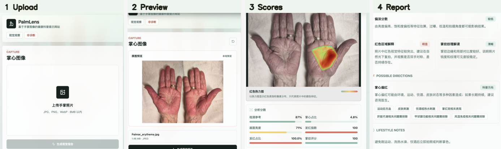
</p>

<p align="center"><sub>上传 → 预览 → 分析分数 → 健康报告 · Upload → Preview → Scores → Health report</sub></p>

<a id="screenshots"></a>

## Screenshots · 产品界面（GitHub 展示）

| | | | |
|:---:|:---:|:---:|:---:|
| 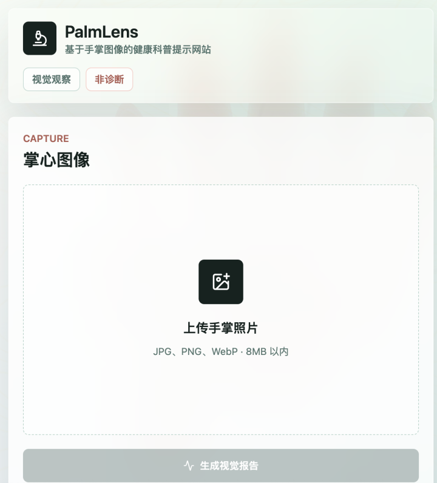 | 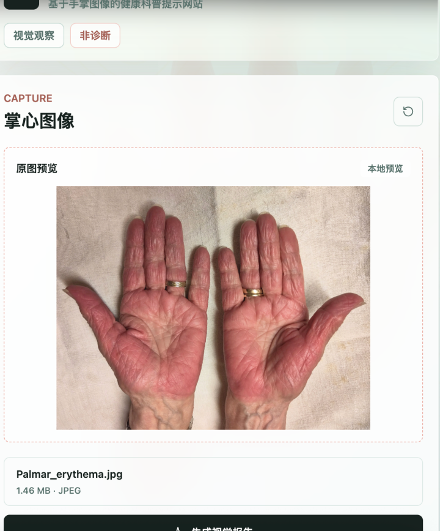 | 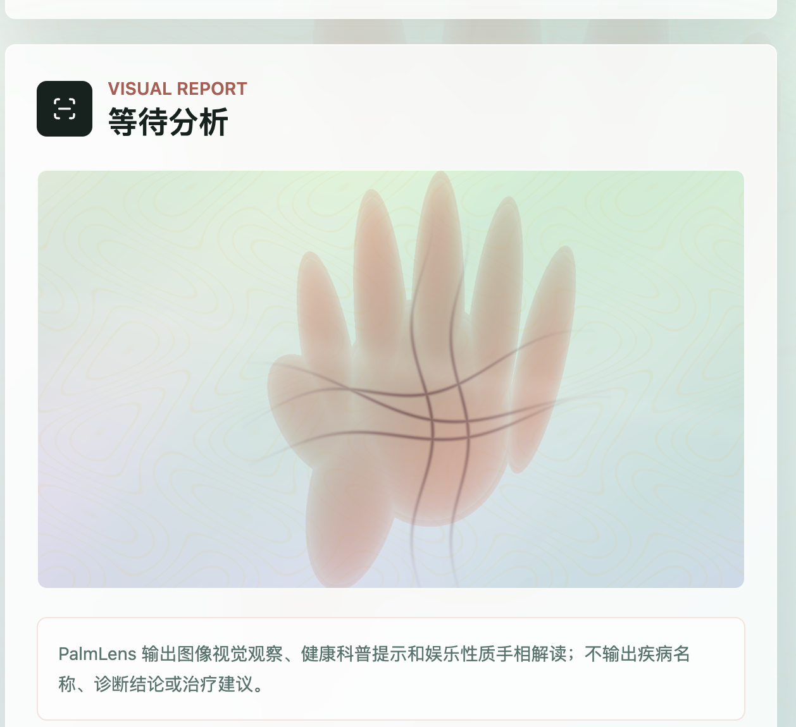 | 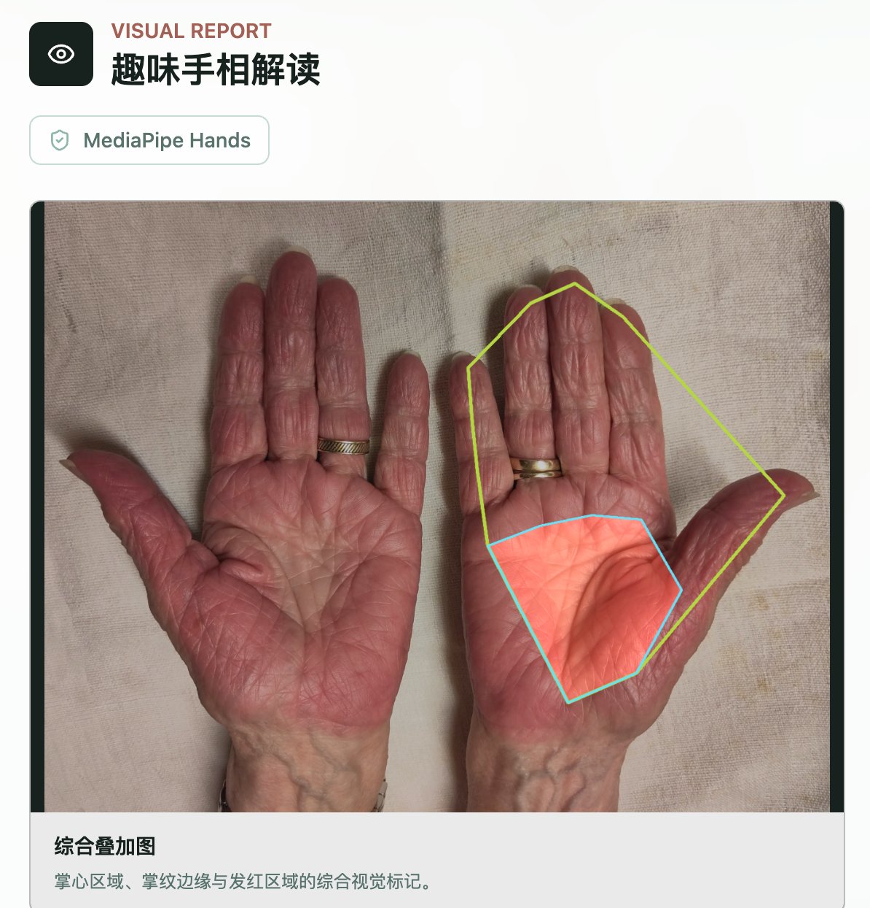 |
| 首页上传 | 原图预览 | 等待分析 | 综合叠加图 |
| 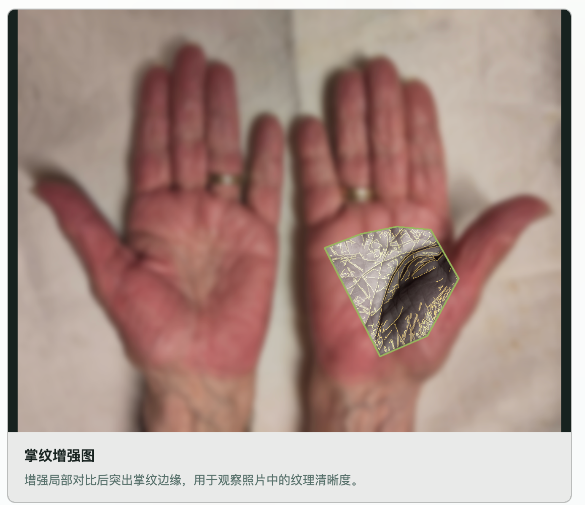 | 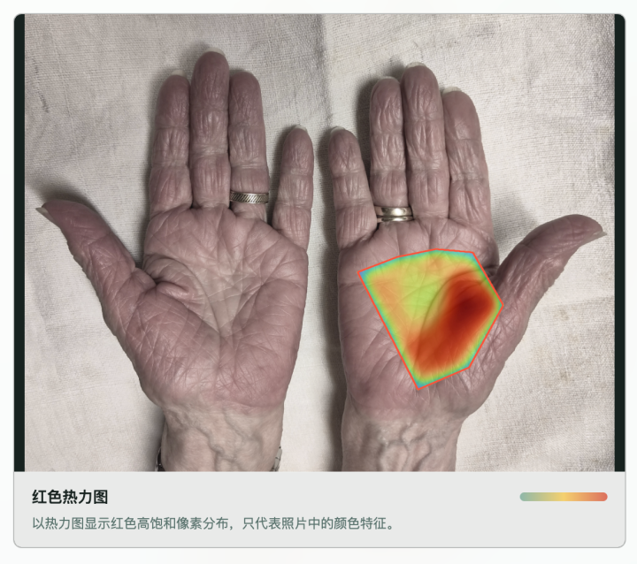 | 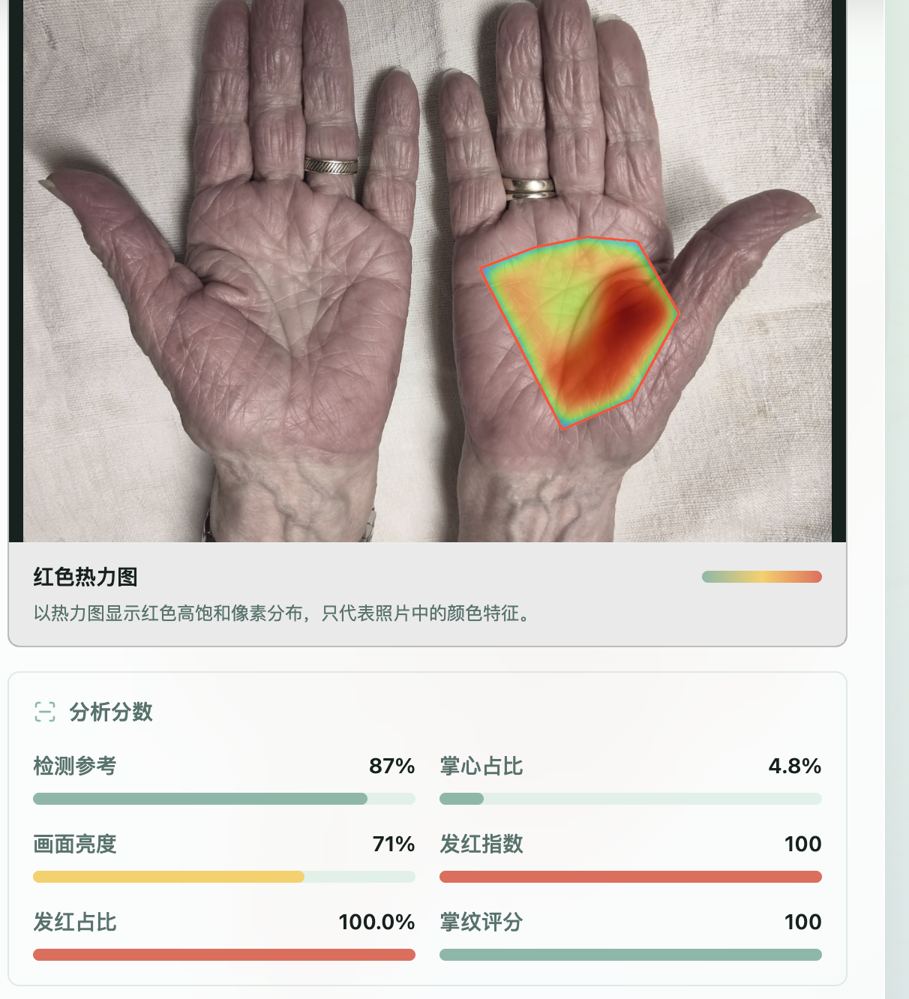 | 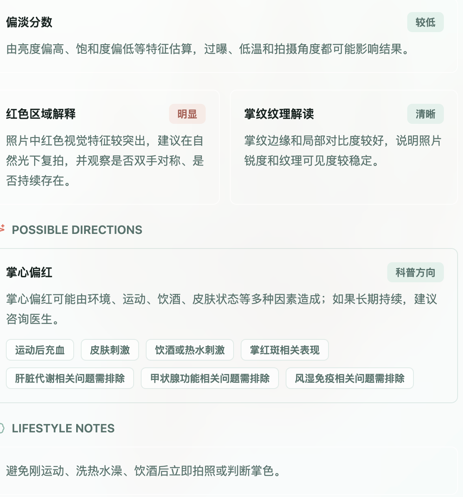 |
| 掌纹增强 | 红色热力图 | 分析分数 | 健康分析详情 |

<details>
<summary><strong>Full-size views · 点击查看大图</strong></summary>

| Step | 截图 Screenshot |
|:--:|:--|
| 1 |  |
| 2 |  |
| 3 |  |
| 4 |  |
| 5 |  |
| 6 |  |
| 7 |  |
| 8 |  |

</details>

---

## Overview · 项目概览

### What is PalmLens? · 这是什么？

**EN:** PalmLens is a full-stack web app that turns a single palm photograph into an interactive, **non-diagnostic** visual report. The frontend (Next.js) handles upload, preview, and bilingual-friendly UI; the backend (FastAPI + OpenCV + MediaPipe) locates the palm, quantifies color and texture, renders three explanation images, and returns structured JSON for health education and optional entertainment palmistry.

**中文：** PalmLens 是一个全栈 Web 应用：用户上传一张手掌照片，系统生成一份**非诊断型**互动视觉报告。前端（Next.js）负责上传、预览与报告展示；后端（FastAPI + OpenCV + MediaPipe）定位掌心、量化颜色与纹理、输出三张解释图，并以 JSON 形式返回健康科普与可选的趣味手相内容。

### Who is it for? · 适合谁？

| Audience · 对象 | Use case · 场景 |
|-----------------|-----------------|
| General users · 普通用户 | Learn how lighting and photo quality affect what you see in a palm image · 了解光线与拍摄质量如何影响掌图观感 |
| Developers · 开发者 | Reference pipeline: hand ROI → metrics → overlays → API contract · 参考「手掌 ROI → 指标 → 叠加图 → API」实现 |
| Educators / demos · 科普演示 | Show computer-vision outputs with clear medical boundaries · 演示计算机视觉结果并强调非诊断边界 |

### What it is NOT · 明确不做的事

**EN:** Not a medical device. No disease names, no diagnosis, no prescriptions. Palmistry is labeled as entertainment only.

**中文：** 不是医疗器械。不输出疾病名称、不做诊断、不给处方。手相模块标注为娱乐用途。

### How it works · 工作原理

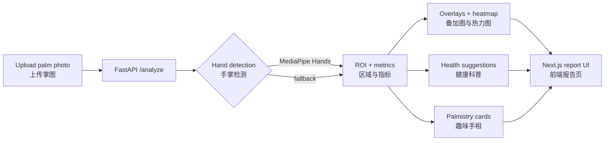

1. **Upload · 上传** — JPG / PNG / WebP, max 8 MB, local preview before submit.  
2. **Analyze · 分析** — `POST /analyze` runs palm detection, color stats, redness patches, line clarity.  
3. **Visualize · 可视化** — Overlay (ROI + edges + redness), line-enhanced view, red saturation heatmap.  
4. **Report · 报告** — Scores, health education blocks, recheck tips; switch to palmistry mode for fun line cards.

### Repository layout · 目录结构

```text
PalmLens/
├── frontend/          Next.js 15 app (upload UI + report)
├── backend/           FastAPI analyzer + OpenCV / MediaPipe
├── docs/images/       README screenshots & analyzer exports
├── scripts/           Asset + GitHub image export tools
└── render.yaml        Render backend blueprint
```

### Screenshot guide · 界面说明

| # | Screen · 界面 | Description · 说明 |
|---|---------------|-------------------|
| 1 | 首页上传 | Drag-and-drop; tags: visual observation, non-diagnostic · 拖拽上传，非诊断 |
| 2 | 原图预览 | Local preview before API call · 分析前本地预览 |
| 3 | 等待分析 | Report placeholder + disclaimer · 报告区占位与声明 |
| 4 | 综合叠加 | MediaPipe ROI, lines, redness · 掌心区域与发红标记 |
| 5 | 掌纹增强 | Contrast-enhanced creases · 掌纹边缘强化 |
| 6 | 红色热力图 | High-saturation red pixels only · 红色像素分布 |
| 7 | 分析分数 | Six metric bars · 六项量化分数 |
| 8 | 健康详情 | Education cards + lifestyle notes · 科普解读与生活建议 |

<details>
<summary><strong>Algorithm demo (synthetic sample) · 算法示意图（内置样例图）</strong></summary>

<p align="center">
  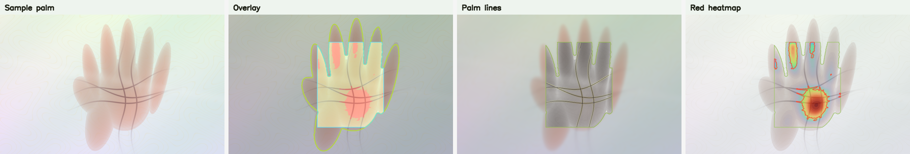
</p>

</details>

---

<a id="english"></a>

## English

### Features

- Upload JPG, PNG, or WebP (max 8 MB) with in-browser preview.
- `POST /analyze` returns JSON: images (base64), metrics, observations, tips, `health_suggestions`, `palmistry`.
- Three derived images: overlay, line-enhanced, red heatmap.
- Health mode: attention level, color/redness/texture copy, quality notes, recheck plan, when to see a doctor.
- Palmistry mode: archetype, keywords, four line cards—entertainment disclaimer included.
- Detection: MediaPipe Hands first; OpenCV skin segmentation fallback.

### Tech stack

```text
frontend/  Next.js 15 + React 19 + Tailwind CSS + lucide-react
backend/   FastAPI + OpenCV + NumPy + MediaPipe Hands
scripts/   generate_palm_asset.py, export_github_images.py
```

### API

| Method | Path | Description |
|--------|------|-------------|
| `GET` | `/health` | Service health |
| `POST` | `/analyze` | Multipart `file` → full report JSON |

### Run locally

**Backend:**

```bash
cd backend
python3 -m venv .venv && source .venv/bin/activate
pip install -r requirements.txt
uvicorn app.main:app --reload --host 127.0.0.1 --port 8000
```

**Frontend:**

```bash
cd frontend && pnpm install && pnpm dev
# NEXT_PUBLIC_API_URL=http://127.0.0.1:8000  →  http://127.0.0.1:3000
```

**Tests & build:**

```bash
backend/.venv/bin/python -m unittest discover -s backend/tests
cd frontend && npm run lint && npm run build
```

**Or using Docker:**
👉 [Docker Local Deployment Guide (EN)](LOCAL_DEPLOY_GUIDE_en.md)

### Deployment

| Part | Platform | Notes |
|------|----------|--------|
| Frontend | Vercel | Root: `frontend` |
| Backend | Render | `render.yaml`, Docker, `/health` |

Set `NEXT_PUBLIC_API_URL` on Vercel and `ALLOWED_ORIGINS` on Render (comma-separated frontend URLs). Use your own deployment URL — **`https://palmlens.vercel.app` is a different site and is not this repository.**

### Regenerate analyzer preview images

```bash
backend/.venv/bin/python scripts/export_github_images.py
```

UI screenshots are stored under `docs/images/screenshots/` (committed manually when the product UI changes).

### Roadmap

Optional custom red-region model (e.g. YOLO); keep non-diagnostic disclaimers and avoid mapping pixels directly to disease labels.

---

<a id="中文"></a>

## 中文

### 功能清单

- 支持 JPG / PNG / WebP，最大 8MB，上传前本地预览。
- `POST /analyze` 返回完整 JSON：图像（base64）、指标、观察项、提示、`health_suggestions`、`palmistry`。
- 三张衍生图：综合叠加、掌纹增强、红色热力图。
- **健康分析**：视觉关注等级、掌色/发红/掌纹说明、图片质量、复查计划、何时建议就医。
- **趣味手相**：原型、关键词、四条线卡片；含娱乐声明。
- 手掌检测优先 MediaPipe Hands，失败时用 OpenCV 肤色分割兜底。

### 技术栈

```text
frontend/  Next.js 15 + React 19 + Tailwind CSS + lucide-react
backend/   FastAPI + OpenCV + NumPy + MediaPipe Hands
scripts/   视觉资产生成、GitHub 配图导出
```

### 接口

| 方法 | 路径 | 说明 |
|------|------|------|
| `GET` | `/health` | 健康检查 |
| `POST` | `/analyze` | 表单字段 `file`，返回完整报告 |

### 本地运行

**后端：**

```bash
cd backend
python3 -m venv .venv && source .venv/bin/activate
pip install -r requirements.txt
uvicorn app.main:app --reload --host 127.0.0.1 --port 8000
```

**前端：**

```bash
cd frontend && pnpm install && pnpm dev
# 默认请求 http://127.0.0.1:8000，浏览器打开 http://127.0.0.1:3000
```

**验证：**

```bash
backend/.venv/bin/python -m unittest discover -s backend/tests
cd frontend && npm run lint && npm run build
```

**或者使用 Docker:**  
👉 [Docker 本地部署指南 (中文)](LOCAL_DEPLOY_GUIDE_zh.md)

### 部署

| 部分 | 平台 | 说明 |
|------|------|------|
| 前端 | Vercel | 根目录 `frontend` |
| 后端 | Render | `render.yaml` + Docker，`/health` |

Vercel 配置 `NEXT_PUBLIC_API_URL`；Render 配置 `ALLOWED_ORIGINS`（多个域名英文逗号分隔）。本地 `localhost:3000` 默认已放行。

部署后使用你自己的 Vercel 域名（不要使用他人占用的 `palmlens.vercel.app`，该站点与本文库无关）。

### 更新 GitHub 配图

```bash
# 分析器输出的示意图
backend/.venv/bin/python scripts/export_github_images.py

# 界面截图：替换 docs/images/screenshots/ 后提交
```

### 后续方向

可接入自定义红色区域检测模型；上线须保留非诊断声明，避免将视觉特征直接等同于疾病结论。

---

## License & disclaimer · 声明

PalmLens is for **education and entertainment** only. Consult qualified professionals for health concerns.  
PalmLens **仅供科普与娱乐**，健康问题请咨询专业医疗人员。
